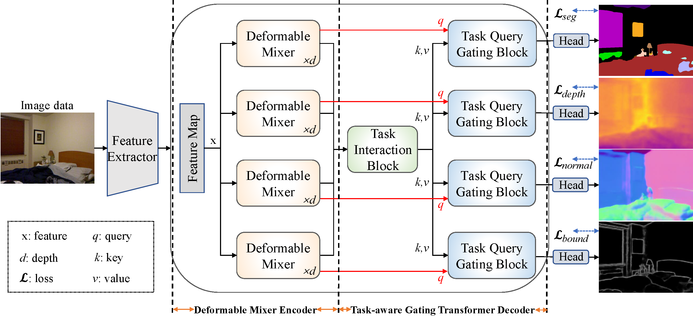

# Deformable Mixer Transformer with Gating for Multi-Task Learning of Dense Prediction

This repo is the official implementation of ["DeMTG"](https://arxiv.org/abs/2301.03461) as well as the follow-ups. It currently includes code and models for the following tasks:


## Updates

***07/07/2023***
We release the models and code of DeMTG.


## Introduction

**DeMTG** (the name `DeMTG` stands for **De**formable **M**ixer **T**ransformer with **G**ating for Multi-Task Learning of Dense
Prediction) is initially described in [arxiv](https://arxiv.org/pdf/2301.03461.pdf), which is an extension to our previous AAAI 2023.
We introduce deformable mixer Transformer with gating (DeMTG), a simple and effective encoder-decoder architecture up-to-date that incorporates the convolution and attention mechanism in a unified network for MTL.
DeMTG achieves strong performance on PASCAL-Context (`75.33 mIoU semantic segmentation` and `63.11 mIoU Human Segmentation` on test) and
 and NYUD-v2 semantic segmentation (`54.34 mIoU` on test), surpassing previous models by a large margin.



## Main Results on ImageNet with Pretrained Models

**DeMTG on NYUD-v2 dataset**

| model|backbone|#params| FLOPs | SemSeg| Depth | Noemal|Boundary| model checkpopint | log |
| :---: | :---: | :---: | :---: | :---: | :---: | :---: | :---: |:---: |:---: |
| DeMTG | Swin-T | 33.2M  |125.49G |47.20	 |0.5660  |20.15  |77.2| [Google Drive]() | [log]()  |
| DeMTG | Swin-S | 54.52M |145.84G |52.23	 |0.5599  |20.05	 |78.4 | [Google Drive]() | [log]()|
| DeMTG | Swin-B | 94.4M  |-G      |54.45  |0.5228  |19.33  |78.6 | [Google Drive]() | [log]() |
| DeMTG | Swin-L | 202.92 |321.22G |57.55	 |0.5037	 |19.21	 |79.0 | [Google Drive]() | [log]() |

**DeMTG on PASCAL-Contex dataset**

| model | backbone |  SemSeg | PartSeg | Sal | Normal| Boundary| 
| :---: | :---: | :---: | :---: | :---: | :---: | :---: |
| DeMTG | Swin-T | 69.44	 |58.02	 |83.31	 |14.31  |71.2 | [Google Drive]() | [log]()  |
| DeMTG | Swin-S | 71.54  |61.49	 |83.70  |14.90  |72.2 | [Google Drive]() | [log]()  |
| DeMTG | Swin-B | 75.37  |64.82	 |83.75	 |14.22	 |73.0 | [Google Drive]() | [log]()  |
| DeMTG | Swin-L | 78.54	 |67.42	 |83.74	 |14.17	 |74.9 | [Google Drive]() | [log]()  |


## Citing DeMTG multi-task method

```
@inproceedings{xyy2023DeMT,
  title={DeMT: Deformable Mixer Transformer for Multi-Task Learning of Dense Prediction},
  author={Xu, Yangyang and Yang, Yibo and Zhang, Lefei },
  booktitle={Proceedings of the The Thirty-Seventh Conference on Artificial Intelligence (AAAI)},
  year={2023}
}

@inproceedings{xyy2023DeMTG,
  title={Deformable Mixer Transformer with Gating for Multi-Task Learning of Dense Prediction},
  author={Xu, Yangyang and Yang, Yibo and Zhang, Lefei },
  booktitle={arxiv},
  year={2023}
}
```


## Getting Started
**Install and Data Prepare**

```
Please reference to [DeMT](https://github.com/yangyangxu0/DeMT)
```


**Train**

To train DeMTG model:
```
python ./src/main.py --cfg ./config/t-nyud/swin/siwn_t_DeMTG.yaml --datamodule.data_dir $DATA_DIR --trainer.gpus 8
```

**Evaluation**

- When the training is finished, the boundary predictions are saved in the following directory: ./logger/NYUD_xxx/version_x/edge_preds/ .
- The evaluation of boundary detection use the MATLAB-based [SEISM](https://github.com/jponttuset/seism) repository to obtain the optimal-dataset-scale-F-measure (odsF) scores.


## Acknowledgement
This repository is based [ATRC](https://github.com/brdav/atrc). Thanks to [ATRC](https://github.com/brdav/atrc)!

